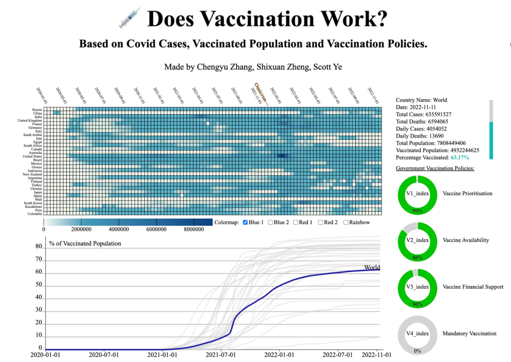
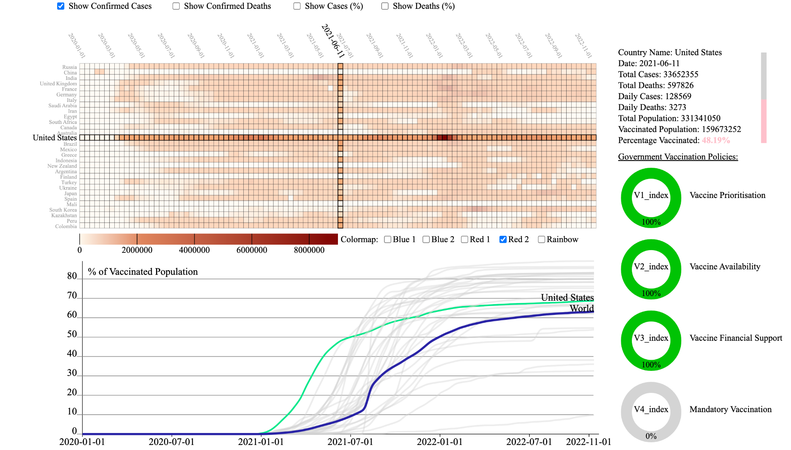

# Does Vaccination Work? - Based on Covid Cases, Vaccinated Population and Vaccination Policies.

### Information Visualization Fall 2022 Final Project.

#### Made by: William Zhang [cz1627@nyu.edu](mailto:cz1627@nyu.edu), Scott Ye [my2152@nyu.edu](mailto:my2152@nyu.edu), Shixuan Zheng [sz2942@nyu.edu](mailto:sz2942@nyu.edu).  

#### Dataset: Oxford Covid-19 Government Response Tracker ([OxCGRT](https://github.com/OxCGRT/covid-policy-tracker))

#### Project link:

https://mstxy.github.io/Does-Vaccination-Work

### 1. Overview:

COVID-19 vaccines were expected to be effective in preventing severe illness, hospitalization, and death from coronavirus. For many countries, getting people vaccinated against COVID-19 has become one of the key objectives in combating the pandemic. However, did the mass vaccination effectively reduce the spread of COVID-19 and its related death? To address this concern, we proposed a visualization system for the health authorities, policymakers, and the general public. Our system illustrates the trends in vaccination rates in various countries associated with the number of reported COVID-19 cases, deaths, and the strictness of vaccination policy. Our visualization reveals that, as the vaccinated population grows, the number of confirmed deaths actually increases across the world, indicating the ineffectiveness of Covid vaccines.

### 2. Dataset:

The data source is The Oxford Covid-19 Government Response Tracker ([OxCGRT](https://github.com/OxCGRT/covid-policy-tracker)) dataset, which includes systematic information on policy measures that governments have taken to tackle COVID-19 since Jan 1, 2020. The dataset is in table type. There are around 197,000 records in total, each having country information, COVID-19 statistics, indicators of government response, and policy indices. We used the following attributes: ConfirmedCases, ConfirmedDeaths, MajorityVaccinated, PopulationVaccinated, Vaccine policies indicators (V1-V4).

We conducted data preprocessing using pandas on JupyterLab:
1.	Selected around 20 countries that have the most representative data.
2.	Derived new attributes: number of the population vaccinated for each country and worldwide, global cases and deaths, and percentage for index V1-V4.
3.	Aggregated the daily data for every month and every ten days.

### 3. Goals and Tasks

Our main goal is to construct an intuitive and straightforward visualization for the general public and authorities to make decisions on whether to receive/promote the Covid vaccinations based on their effectiveness. 

For the general public: Boris is hesitating about receiving the Covid vaccine because he has chronic respiratory diseases. When Boris logs on to the system, he will see a matrix diagram displaying the covid cases/deaths for different countries. There are buttons that Boris can select to see the statistics of confirmed cases or deaths. Browsing through the country axis, he will be able to spot Russia. Then, he can place his mouse onto that row, linking to a line chart showing the vaccination status in Russia. He can also see detailed statistics on the right. From the visualization, he can decide whether it is worthwhile to receive the vaccination despite the risk factors of his chronic disease.

For health authorities:  They can view the general trend of COVID-19 for all countries and the world's vaccination status and make wise policies accordingly.

### 4. Visualization

- Matrix Diagram  
This is the main visualization that displays the relationship between Covid cases/deaths and time across different countries. The x-axis is the time attribute, grouped by every ten days. The y-axis will be the different countries. Thus, each cell in the matrix will represent a country in a specific ten-day interval, with the saturation representing the statistics of Covid cases/deaths. Buttons will be adopted to switch between confirmed cases and deaths in either numbers or percentages. Users can select different colormaps with their preferences.

- Line Chart  
Below the matrix diagram, a line chart displays the vaccination status of the world and each country. It will share the x-axis with the matrix diagram. The y-axis will be the percentage of the vaccinated population. Each country is represented by a line and the world by another line. If the result shows a clutter of lines, the line will appear on mouse hover.

- Detailed Info with Multiple Charts  
A third view on the right displays total cases, total deaths, daily cases, daily deaths, total population, vaccinated population, and percentage vaccinated in plain text. A simple bar chart will display the percentage. When there is no user interaction, it will show the world statistics. When one cell in the matrix diagram is hovered over, it will show the statistics of the selected country. In addition, donut charts are adopted to show the vaccination policy of the country when selected, and their descriptions will be displayed through tooltips. Both the bar chart and donut charts are encoded in color (hue) for an effortless interpretation.

-	Links  
The matrix diagram and the line chart will be connected through interaction. On hovering one of the cells, its row and column will be highlighted. The corresponding line in the line chart will also be highlighted. On hovering one of the lines in the line chart, only the corresponding row in the matrix will be highlighted.  
The juxtaposition of the matrix diagram and the line chart, along with the linked interactions and the attributes presented, makes the comparison of vaccination and Covid cases intuitive. With the support of policy strictness and other statistics, a holistic view of the relationship between Covid cases, vaccinated population, and vaccination policies could be formulated.

5.	Reflection

There are several modifications in our final version. Firstly, instead of using months, we decided to adopt ten-day intervals in the matrix diagram, because it generates a visualization with higher accuracy and interpretability. It balances the data variance of each date, and produces enough patterns for the user to identify. 

Secondly, we added a few display options to show either absolute number of cases or the percentage of cases compared to the country’s population, because the population of each country differs significantly and may interfere with the interpretation of the visualization. For the same reason, we changed the line chart to % Population Vaccinated rather than the absolute number. 

We also added display options for showing different color maps, since some colors work better on certain data and we would like to give the freedom to explore our visualization.
Additionally, we modified the original bar chart in the third view to separate donut charts with color endings. Because the vaccination policies we encoded are four separate indices between 0 and 100%, we think a donut chart could better visualize the percentage.

Lastly, after examining the heatmap, we hypothesized that the emergence of omicron may contribute to the increase of confirmed cases and the decrease of confirmed deaths. Therefore, we added a pin indicating the emergence of Omicron, along with a tooltip showing detailed information about it. Indeed, the number of confirmed deaths significantly increases across the world after the emergence of Omicron, while admittedly the number of confirmed deaths decreases for Omicron’s less fatality rate.

Moreover, our visualization goals have also changed throughout the process. Beforehand, we expected that our visualization would provide country-specific information for individual citizens on their vaccination decisions. However, after finalizing the visualization, we realized that Covid vaccine did not help much in stopping the pandemic. Therefore, our visualization goal has shifted to inform the local authorities regarding the need for an effective vaccine with better support of vaccination policies.
